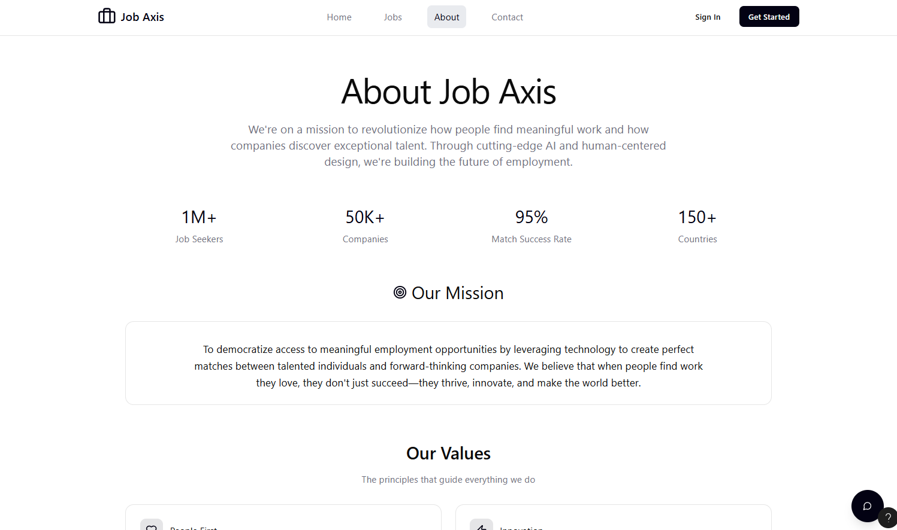

# Job Axis

**Job Axis** is a smart and efficient web-based job portal that connects job seekers with suitable employers. The platform is designed to streamline the hiring process by leveraging Artificial Intelligence to provide personalized job recommendations, reduce mismatches, and save time for both candidates and employers. With a user-friendly interface and modern technologies, Job Axis aims to deliver a seamless and effective experience for all users.

## 🌟 Key Features

-   🔍 **AI-Powered Job Matching**  
    Smart job recommendations based on user profiles, preferences, and behavior.

-   🧑‍💼 **Separate Dashboards**  
    Individual dashboards for job seekers and employers with tailored functionality.

-   📝 **Advanced Job Posting & Application System**  
    Employers can create detailed job listings; users can easily apply and track applications.

-   📊 **Real-Time Analytics**  
    View job insights, application counts, and more.

-   📂 **Resume & Profile Management**  
    Upload resumes, edit personal information, and update job preferences.

-   🔒 **Secure Authentication**  
    Role-based access with encrypted password handling and secure session management.

-   🌐 **Responsive UI**  
    Fully responsive design for mobile, tablet, and desktop using modern front-end tools.

-   🛠️ **Admin Panel**  
    Manage users, job categories, reports, and site-wide settings efficiently.

## 🛠️ Technologies Used

-   **Backend**: Laravel (PHP Framework)
-   **Database**: phpMyAdmin (MySQL)
-   **Frontend**: React JS (JavaScript Library)
-   **Authentication**: Laravel Breeze / Sanctum (or Passport)
-   **Styling**: Tailwind CSS / Bootstrap
-   **AI Integration**: (Planned) Machine Learning models for job matching
      

# Group Members/Collaboratos

**Members:** 

-   Jabin Tasnim **(20220204058)**  [Jabin's WakaTime](https://wakatime.com/@jabin03/projects/eiguabqmbp?start=2025-07-21&end=2025-07-27)
-   Faiad Nakib **(20220204080)**  [Faiad's WakaTime](https://wakatime.com/@7d570a56-773f-4e49-8d78-0b0803fea282/projects/cotjcdyaqo?start=2025-07-20&end=2025-07-26)

-   Sadeed Rahman **(20220204081)**  [Sadeed's WakaTime](https://wakatime.com/@3764e15a-69bc-4b7d-ad15-f837a011962c/projects/yhmzwifodz)

-   Ariyan Islam Abir **(20220204083)**  [Abir's WakaTime](https://wakatime.com/@77b92341-2c76-4833-925d-42b65958bf2f/projects/fjvpthdehc?start=2025-07-20&end=2025-07-26)

  

# UI/UX Concept(Figma Design)

[Figma Design – Job Portal Application](https://www.figma.com/make/0LyGzxitBmQ9GJ6LV52d8a/Job-Portal-Application?node-id=0-1&p=f&t=AV7PVaUiNfiQpVKw-0)
  

## HomePage

Consists of Search Bar as well as Some Featured Jobs

&nbsp;&nbsp;

## Artificial Intelligence

Artificial Intelligence Assistance is available to both Job seekers and Providers on this site.

&nbsp;&nbsp;

## Available Jobs Page

Shows avaible Jobs and also provides users to filter and select out Jobs based on their desired skills/qualifications

&nbsp;&nbsp;

## Contact Page

Provides users to communicate with Developers/Admins of the site regarding the issues/difficulties they may face in using this site

&nbsp;&nbsp;

## About Us

&nbsp;&nbsp;

  

## Login/Registration Page

&nbsp;&nbsp;

